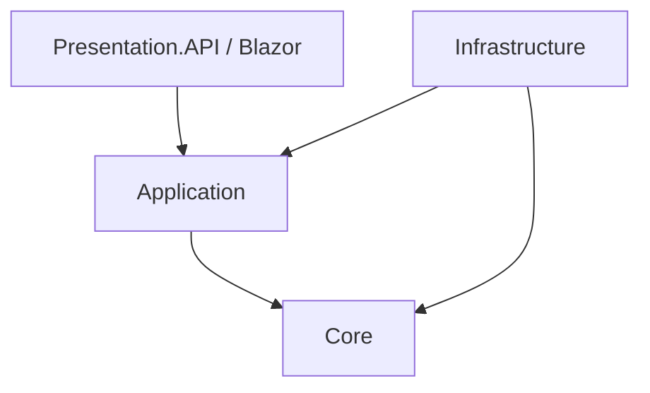

# 📐 Arquitectura del Sistema

Este proyecto sigue los principios de **Clean Architecture** (Arquitectura Limpia) y **Domain-Driven Design (DDD)** para asegurar un código mantenible, escalable y testeable.

## 🏗️ Estructura de Capas

El sistema está dividido en 4 capas concéntricas, donde las dependencias fluyen hacia adentro:

### 1. Core (`BotCarniceria.Core`)
Es el núcleo de la aplicación. No tiene dependencias externas.
- **Entities**: Objetos de dominio (`Pedido`, `Cliente`, `Mensaje`).
- **Interfaces**: Contratos de repositorios (`IOrderRepository`) y servicios (`ICacheService`).
- **Specifications**: Lógica de consultas reutilizable (`PedidosActiveSpecification`).
- **Domain Services**: Lógica pura de negocio.
- **Value Objects**: Objetos inmutables (`Address`, `Money`).

### 2. Application (`BotCarniceria.Application.Bot` / `.Shared`)
Contiene la lógica de la aplicación y coordinadores.
- **Services**: Implementaciones de servicios de aplicación (`SessionService`).
- **Handlers**: Manejadores de mensajes (`IncomingMessageHandler`) y estados (`MenuStateHandler`).
- **DTOs**: Objetos de transferencia de datos.
- **Interfaces**: Contratos definidos por la aplicación.

### 3. Infrastructure (`BotCarniceria.Infrastructure`)
Implementa las interfaces definidas en Core y Application.
- **Persistence**: Entity Framework Core, Repositorios (`OrderRepository`), `UnitOfWork`.
- **External Services**: Cliente de WhatsApp API, Servicios de Impresión TCP/IP.
- **Caching**: Implementación de Redis/MemoryCache.

### 4. Presentation (`.API` / `.Blazor`)
Puntos de entrada de la aplicación.
- **API**: Controladores REST, Webhook Endpoint de WhatsApp.
- **Blazor**: Interfaz de usuario administrativa (Dashboard), Componentes MudBlazor.

## 🧩 Patrones de Diseño Implementados

### Repository & Unit of Work
Abstracción completa del acceso a datos.
- **Repository**: Colección en memoria de objetos de dominio. Provee métodos CRUD y de búsqueda.
- **UnitOfWork**: Mantiene una lista de objetos afectados por una transacción de negocio y coordina la escritura de cambios y la resolución de problemas de concurrencia. Garantiza transaccionalidad (Commit/Rollback).

### Specification Pattern
Encapsula la lógica de consulta de dominio en objetos individuales.
- Permite combinar reglas de negocio (`b.And(c).Or(d)`).
- Desacopla la lógica de consulta de los repositorios.
- Facilita el testing de reglas de negocio complejas.

### Strategy Pattern
Utilizado para el manejo extensible de mensajes y estados.
- `IncomingMessageHandler` selecciona la estrategia adecuada (`TextMessageTypeHandler`, `InteractiveMessageTypeHandler`) basada en el tipo de mensaje entrante.
- Elimina sentencias `switch` gigantes y facilita agregar nuevos tipos de mensajes.

### State Pattern (Finite State Machine)
Controla el flujo de conversación del usuario.
- Cada estado (`Menu`, `AskingName`, `TakingOrder`) es una clase separada.
- Centraliza la lógica de transición y validación de entrada para ese estado específico.

### Factory Pattern
- `StateHandlerFactory`: Encapsula la creación compleja de handlers de estado, inyectando dependencias necesarias.

## 🚀 Decisiones Técnicas Clave

1. **Sesiones Persistentes**: El estado de la conversación se guarda en base de datos y se cachea en memoria para velocidad. Esto permite escalar horizontalmente si se usa Redis.
2. **Manejo de Errores**: Middleware global de excepciones y bloques Try/Catch en UnitOfWork para asegurar integridad de datos.
3. **Validación**: FluentValidation para validar DTOs y comandos antes de procesarlos.
4. **Loggin Estructurado**: Serilog para trazabilidad completa de cada mensaje y error.
