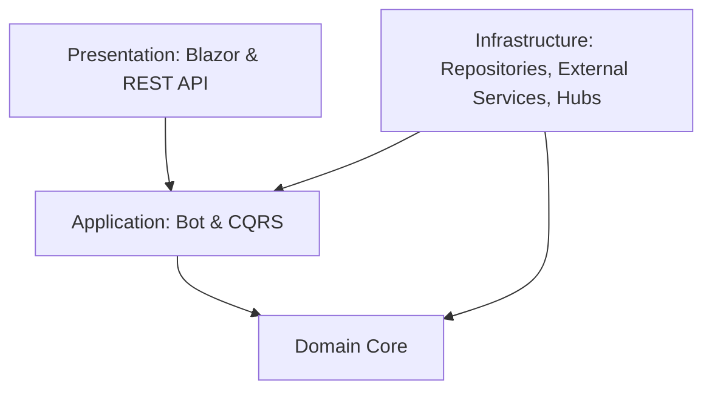

# 📐 Arquitectura del Sistema

Este proyecto está diseñado y construido siguiendo los principios de **Clean Architecture** (Arquitectura Limpia), **Domain-Driven Design (DDD)**, **CQRS** y **SOLID**, garantizando un alto grado de desacoplamiento, resiliencia, mantenibilidad y cobertura de pruebas.

---

## 🏗️ Estructura de Capas

El sistema se divide en 4 capas concéntricas donde las dependencias fluyen estrictamente hacia el interior:

```mermaid
graph TD
    UI[Presentation: Blazor & REST API] --> AppBot[Application: Bot & CQRS]
    Infra[Infrastructure: Repositories, External Services, Hubs] --> AppBot
    Infra --> Core[Domain Core]
    AppBot --> Core
```

### 1. Domain Core (`BotCarniceria.Core.Domain`)
El núcleo puro del sistema sin dependencias externas ni de frameworks:
* **Entities**: `Pedido`, `Cliente`, `Mensaje`, `Conversacion`, `SolicitudFactura`, `Usuario`, `Configuracion`.
* **Value Objects**: `Folio`, `DatosFacturacion`, etc.
* **Domain Events**: `PedidoCreatedEvent`, `SolicitudFacturaCreadaDomainEvent`.
* **Domain Services & Abstracciones**: `IDateTimeProvider`, `IUnitOfWork`, contratos de repositorios.
* **Specifications**: Lógica de consulta encapsulada (`PedidosActiveSpecification`, `ClienteByPhoneNumberSpecification`, `SupervisorsWithPhoneSpecification`).

### 2. Application Layer (`BotCarniceria.Core.Application` & `BotCarniceria.Application.Bot`)
Contiene los casos de uso, orquestadores y la lógica de la máquina de estados:
* **CQRS (Commands & Queries)**: Comandos y consultas gestionados por MediatR.
* **Máquina de Estados Finita (FSM)**: Handlers para cada estado de la conversación (`IConversationStateHandler`).
* **Event Handlers**: Manejadores asíncronos para eventos de dominio (`PedidoCreatedEventHandler`).
* **Strategy Handlers**: Procesadores polimórficos de tipos de mensajes entrantes.

### 3. Infrastructure Layer (`BotCarniceria.Infrastructure`)
Implementaciones concretas de la persistencia y de integraciones con el mundo exterior:
* **Persistence**: Entity Framework Core 8, `BotCarniceriaDbContext`, Repositorios, Migraciones, `DbInitializer`.
* **External Clients**: `WhatsAppService` (Meta Graph API), `PrintingService` (Raw ESC/POS TCP Sockets).
* **Caching & Background**: `CacheService` (MemoryCache/Redis), Hangfire Job Processing.
* **Real-time Hubs**: ASP.NET Core SignalR (`ChatHub`).

### 4. Presentation Layer (`BotCarniceria.Presentation.*`)
Puntos de entrada de usuarios y sistemas externos:
* **`Presentation.API`**: Controladores Webhook de WhatsApp con validación criptográfica HMAC-SHA256 y endpoints REST.
* **`Presentation.Blazor`**: Panel administrativo y operativo en tiempo real con MudBlazor + Portal público para solicitud de facturas.

---

## 🧩 Patrones de Diseño Principales

### 1. CQRS (Command Query Responsibility Segregation) con MediatR
Separa las operaciones de lectura (queries de alto rendimiento sin sobrecarga de tracking) de las operaciones de escritura (commands que mutan el modelo de dominio mediante transacciones controladas).

### 2. Domain Events
Permite el desacoplamiento de efectos secundarios. Cuando un pedido es creado, la entidad dispara un `PedidoCreatedEvent`, que es gestionado asíncronamente para:
1. Encolar la impresión física del ticket en la impresora de comandas.
2. Notificar por SignalR a los operadores conectados al dashboard.

### 3. Repository & Unit of Work
Abstracción de acceso a datos con control transaccional estricto. Todas las operaciones de escritura en un flujo se confirman en una sola transacción atómica (`CommitAsync`).

### 4. Specification Pattern
Permite construir consultas de base de datos reutilizables, componibles y testeables sin filtrar detalles de Entity Framework hacia la capa de negocio.

### 5. Strategy & State Pattern (FSM)
* **Strategy**: Selección dinámica de procesamiento según el tipo de mensaje entrante (Texto, Botón, Lista, Ubicación).
* **State**: Encapsulamiento del comportamiento y transiciones de la conversación en clases individuales por cada estado.

---

## 🔒 Seguridad y Resiliencia

1. **Autenticación y RBAC**: Sistema de roles (`Admin`, `Supervisor`, `Editor`, `Viewer`) con hashing seguro de contraseñas.
2. **Validación Criptográfica de Webhooks**: Verificación del header `X-Hub-Signature-256` en cada mensaje entrante para garantizar la autenticidad del remitente (Meta).
3. **Resiliencia HTTP (Circuit Breaker)**: Protección contra caídas o lentitud de APIs externas mediante políticas de Polly y colas de reintento en Hangfire.
4. **Persistencia UTC y Globalización**: Almacenamiento homogéneo en UTC en base de datos y conversión transparente a la zona horaria del negocio con `IDateTimeProvider`.
