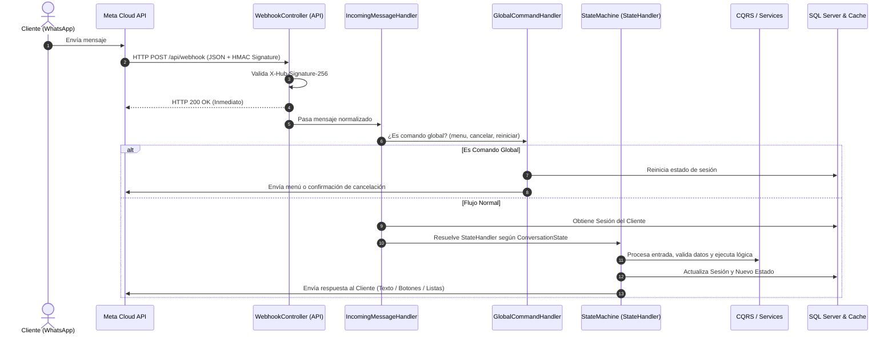

# 📩 Manejo de Mensajes y Flujo del Bot de WhatsApp

Este documento detalla la arquitectura de recepción, procesamiento y despacho de mensajes en el bot de WhatsApp, así como el funcionamiento exhaustivo de la **Máquina de Estados Finita (FSM)**.

---

## 🔄 Flujo Integral de Procesamiento

---

## 🚦 Estados de la Conversación (Máquina de Estados)

La conversación con el cliente se gestiona mediante estados estrictamente controlados en el enum `ConversationState`:

| Estado | Handler Asociado | Descripción | Input Esperado | Siguiente Estado Posible |
| :--- | :--- | :--- | :--- | :--- |
| **`START`** | `StartStateHandler` | Bienvenida al cliente. | Cualquier mensaje inicial. | `MENU` / `ASK_NAME` |
| **`MENU`** | `MenuStateHandler` | Router principal de opciones. | Selección de botón ("Hacer Pedido", "Horarios", "Facturación"). | `TAKING_ORDER`, `BILLING_*`, `START` |
| **`ASK_NAME`** | `AskNameStateHandler` | Captura del nombre para clientes nuevos. | Texto libre con su nombre. | `MENU` |
| **`TAKING_ORDER`** | `TakingOrderStateHandler` | Captura del primer bloque del pedido y validación de horarios. | Texto libre con los productos deseados. | `CONFIRM_LATE_ORDER` o `ADDING_MORE` |
| **`CONFIRM_LATE_ORDER`** | `ConfirmLateOrderStateHandler` | Advertencia sobre horario tardío y posibles demoras. | Botón Sí (Continuar) / No (Cancelar). | `ADDING_MORE` (si Sí) o `MENU` (si No) |
| **`ADDING_MORE`** | `AddingMoreStateHandler` | Permite acumular más artículos o finalizar la lista. | Texto con más productos o botón "Terminar Pedido". | `ADDING_MORE` (más productos) o `ASK_ADDRESS` |
| **`ASK_ADDRESS`** | `AskAddressStateHandler` | Solicitud de la dirección de entrega. | Mensaje de texto con dirección o Location de WhatsApp. | `CONFIRM_ADDRESS` |
| **`CONFIRM_ADDRESS`** | `ConfirmAddressStateHandler` | Confirmación de la dirección ingresada. | Botón "Sí, es correcta" / "Cambiar dirección". | `SELECT_PAYMENT` o `ASK_ADDRESS` |
| **`SELECT_PAYMENT`** | `SelectPaymentStateHandler` | Selección de la forma de pago. | Botones interactivos (Efectivo, Tarjeta, Transferencia). | `AWAITING_CONFIRM` |
| **`AWAITING_CONFIRM`** | `AwaitingConfirmStateHandler` | Resumen total y confirmación de la orden. | Botón "Confirmar Pedido" / "Cancelar". | `START` (Pedido creado) o `MENU` |
| **`BILLING_*`** | `BillingStateHandler` | Flujo guiado de captura de datos de facturación en el chat. | RFC, Razón Social, Dirección, Folio de ticket, Total y Uso CFDI. | `MENU` (Solicitud creada) |

---

## ⚡ Comandos Globales de Interrupción

En cualquier momento de la interacción, el usuario puede enviar palabras clave reservadas que anulan el estado actual:

1. **`menu` / `menú`**: Redirige directamente al estado `MENU` sin perder datos esenciales de la cuenta del cliente.
2. **`cancelar`**: Cancela la operación en curso, limpia el carrito temporal de productos y reinicia la sesión.
3. **`reiniciar` / `inicio`**: Restablece por completo la sesión del cliente al estado `START`.

---

## 🧩 Patrón Strategy para Tipos de Mensajes

El `IncomingMessageHandler` utiliza la fábrica `IMessageTypeHandlerFactory` para despachar el mensaje al handler correspondiente según el formato recibido desde Meta:

* **`TextMessageTypeHandler`**: Normaliza texto, elimina espacios extras y gestiona comandos escritos.
* **`InteractiveMessageTypeHandler`**: Procesa las respuestas de botones (`button_reply`) y selecciones de lista (`list_reply`).
* **`LocationMessageTypeHandler`**: Extrae coordenadas y nombres de ubicación enviados por el cliente para la dirección de entrega.
* **`ImageMessageTypeHandler` / `DocumentMessageTypeHandler`**: Gestiona el soporte multimedia (comprobantes de pago, fotos de productos).
* **`UnsupportedMessageTypeHandler`**: Responde con un mensaje amable cuando el cliente envía un tipo de contenido no procesable (ej. notas de voz o stickers).
