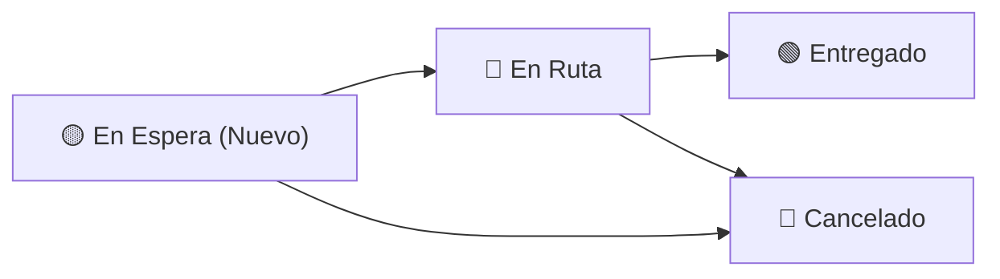
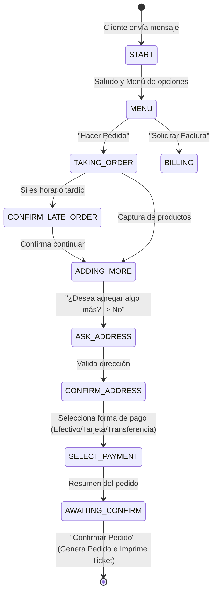

# 📖 Manual de Operación - Bot de Carnicería

Bienvenido al **Manual de Operación** del sistema de gestión de pedidos y bot de WhatsApp para carnicería. Este documento está diseñado para el personal operativo, supervisores y administradores que interactúan diariamente con el sistema.

---

## 📑 Tabla de Contenidos
1. [Acceso e Inicio de Sesión](#1-acceso-e-inicio-de-sesión)
2. [Roles y Permisos en el Sistema](#2-roles-y-permisos-en-el-sistema)
3. [Módulo de Chats en Vivo](#3-módulo-de-chats-en-vivo)
4. [Gestión de Pedidos](#4-gestión-de-pedidos)
5. [Impresión de Tickets y Comandas](#5-impresión-de-tickets-y-comandas)
6. [Gestión de Facturas Electrónicas](#6-gestión-de-facturas-electrónicas)
7. [Gestión de Clientes](#7-gestión-de-clientes)
8. [Configuraciones del Sistema](#8-configuraciones-del-sistema)
9. [Flujo del Bot de WhatsApp (Perspectiva del Cliente)](#9-flujo-del-bot-de-whatsapp-perspectiva-del-cliente)
10. [Preguntas Frecuentes y Solución de Problemas](#10-preguntas-frecuentes-y-solución-de-problemas)

---

## 1. Acceso e Inicio de Sesión

1. Abra su navegador web e ingrese a la dirección del Dashboard administrativo (ej. `https://pedidos.carnicerialamejor.com` o `http://localhost:5014`).
2. Introduzca su **Nombre de Usuario** y **Contraseña**.
3. Haga clic en **Iniciar Sesión**.

> [!NOTE]
> Por seguridad, las sesiones inactivas caducan automáticamente tras el tiempo configurado en el sistema (por defecto 30 minutos, con un aviso preventivo a los 5 minutos restantes).

---

## 2. Roles y Permisos en el Sistema

El sistema maneja 4 niveles de acceso diferenciados:

| Rol | Icono | Funcionalidades Habilitadas |
| :--- | :---: | :--- |
| **Admin** | 👑 | Acceso total: Chats, Pedidos, Facturas, Clientes, Usuarios, Configuración avanzada y Conversaciones. |
| **Supervisor** | 👨‍💼 | Operación diaria completa: Chats, Pedidos, Facturas y Clientes. Recibe notificaciones automáticas por WhatsApp cuando entra una solicitud de factura. |
| **Editor** | ✏️ | Gestión operativa: Chats y Pedidos (atención de órdenes y cambio de estados). |
| **Viewer** | 👁️ | Solo lectura: Visualización de Chats en tiempo real (monitoreo). |

---

## 3. Módulo de Chats en Vivo

El módulo de **Chats** (`/chats`) permite monitorear y atender en tiempo real las conversaciones con los clientes mediante una interfaz similar a WhatsApp Web.

### Características Principales:
* **Lista de Conversaciones**: Panel lateral izquierdo con las conversaciones activas, ordenadas por fecha del último mensaje. Muestra el estado actual del bot y el último mensaje recibido.
* **Ventana de Mensajes**: Visualización cronológica de mensajes entrantes (verde/gris) y salientes.
* **Intervención Manual**:
  1. Seleccione la conversación deseada.
  2. Escriba el mensaje en la caja de texto inferior.
  3. Presione el botón de **Enviar** (o tecla Enter).
  4. El mensaje se enviará directamente al WhatsApp del cliente a través de la API oficial.

> [!TIP]
> Si un cliente se encuentra confundido en el flujo automático del bot, un operador puede intervenir manualmente enviando un mensaje o indicándole que escriba `menu` o `cancelar` para reiniciar.

---

## 4. Gestión de Pedidos

El módulo de **Pedidos** (`/orders`) centraliza todas las órdenes generadas por los clientes a través de WhatsApp.

### Estados de un Pedido:

### Operaciones con Pedidos:
1. **Ver Detalles**: Haga clic en un pedido para ver el desglose de productos solicitados, dirección de entrega, método de pago, folio y teléfono del cliente.
2. **Cambiar Estado**:
   * Seleccione el nuevo estado (`En Ruta`, `Entregado`, `Cancelado`) desde el menú de acciones del pedido.
   * El sistema actualizará el estado en tiempo real.
3. **Filtrar Pedidos**: Puede filtrar por fecha, estado del pedido o buscar por folio o nombre del cliente.

---

## 5. Impresión de Tickets y Comandas

El sistema cuenta con integración directa a **impresoras térmicas de tickets (ESC/POS)** a través de la red local.

### Flujo de Impresión Automática:
* Cuando un cliente finaliza y confirma su pedido en WhatsApp, el sistema genera automáticamente el ticket e intenta imprimirlo en la impresora configurada.
* **Reintentos automáticos**: Si la impresora está ocupada o apagada temporalmente, el sistema realiza hasta 3 reintentos automáticos según la configuración.

### Impresión Manual / Reimpresión:
1. Diríjase al módulo de **Pedidos**.
2. Abra el detalle del pedido que desea reimprimir.
3. Presione el botón **Reimprimir Ticket**.

---

## 6. Gestión de Facturas Electrónicas

### Solicitud Pública de Facturas
Los clientes pueden solicitar su factura de forma autónoma accediendo al enlace público:
`https://[tu-dominio]/solicitar-factura`

El cliente completará 4 sencillos pasos:
1. Ingreso de RFC.
2. Verificación o carga de datos fiscales (Razón Social, Dirección fiscal, Régimen fiscal, Correo).
3. Datos de la compra (Folio del ticket, Total pagado, Uso de CFDI).
4. Confirmación con folio de solicitud.

### Notificaciones a Supervisores
* En cuanto el cliente envía la solicitud, el sistema envía un **mensaje de WhatsApp automático a todos los Supervisores** registrados con número de teléfono, detallando los datos fiscales y de compra para su emisión en el sistema de facturación.

### Panel de Facturas en el Dashboard (`/facturas`)
* **Listado de Solicitudes**: Muestra solicitudes en estado `Pendiente`, `En Proceso`, `Completada` o `Rechazada`.
* **Procesamiento**: Al emitir la factura en el PAC o SAT, cambie el estado a `Completada` para mantener el control.

---

## 7. Gestión de Clientes

En el módulo de **Clientes** (`/clients`):
* **Directorio de Clientes**: Búsqueda por número telefónico o nombre.
* **Historial**: Consulta de pedidos anteriores y frecuencia de compra.
* **Datos Fiscales**: Consulta y actualización de datos de facturación guardados para agilizar futuras solicitudes.

---

## 8. Configuraciones del Sistema

*(Disponible únicamente para rol **Admin** en `/configs`)*

| Parámetro | Descripción | Valor Típico / Ejemplo |
| :--- | :--- | :--- |
| **Business.Schedule** | Horario de atención al público mostrado en el bot. | `Lunes a Sábado 8:00 - 18:00` |
| **Business.Address** | Dirección física de la sucursal. | `Av. Principal #123` |
| **Business.DeliveryTime** | Tiempo promedio estimado de entrega. | `30-45 minutos` |
| **Orders.LateOrderWarningStartHour** | Hora a partir de la cual se advierte al cliente sobre posibles demoras en entrega. | `16:00` (formato 24h) |
| **System.TimeZoneId** | Zona horaria del negocio para fechas y comparaciones. | `Central Standard Time (Mexico)` |
| **Printers.IpAddress** | Dirección IP de la impresora térmica en la red local. | `192.168.1.100` |
| **Printers.Port** | Puerto de red de la impresora térmica. | `9100` |
| **Session.BotTimeoutMinutes** | Minutos de inactividad antes de reiniciar la conversación del bot. | `30` |

---

## 9. Flujo del Bot de WhatsApp (Perspectiva del Cliente)

### Comandos Globales de Emergencia
El cliente puede enviar estas palabras en cualquier momento para reiniciar:
* `menu`: Regresa al menú principal.
* `cancelar`: Cancela el flujo actual y reinicia la sesión.
* `reiniciar`: Limpia la sesión actual e inicia desde el saludo.

---

## 10. Preguntas Frecuentes y Solución de Problemas

### ❓ La impresora no saca el ticket del pedido
1. Verifique que la impresora esté encendida, con papel y conectada a la red local (cable Ethernet o WiFi).
2. Verifique en `/configs` que la dirección IP y el puerto (usualmente `9100`) coincidan con la asignada a la impresora.
3. Intente reimprimir el ticket manualmente desde el detalle del pedido en `/orders`.

### ❓ El cliente no recibe respuestas del bot
1. Compruebe si el cliente tiene una sesión bloqueada; envíele un mensaje manual desde el módulo de Chats pidiéndole que escriba `menu`.
2. Verifique con el Administrador que las credenciales de WhatsApp Business API sigan vigentes.

### ❓ Los supervisores no reciben las notificaciones de facturación
1. Verifique en el módulo de **Usuarios** que los supervisores tengan asignado el rol `Supervisor` y tengan configurado su número de teléfono celular con código de país (ej. `5215512345678`).
