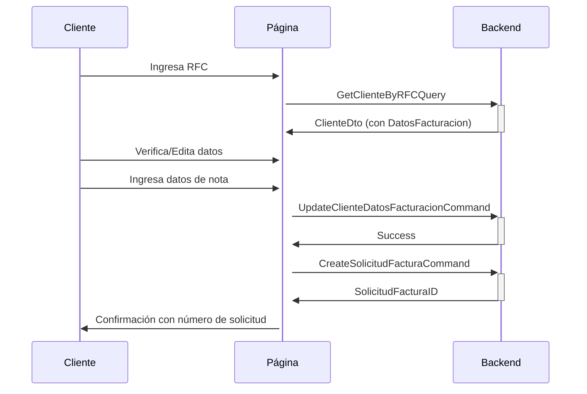

# Página Pública de Solicitud de Factura

## Descripción General

Se ha implementado una página web pública y moderna que permite a los clientes solicitar su factura electrónica de manera autónoma, sin necesidad de autenticación.

## URL de Acceso

```
https://[tu-dominio]/solicitar-factura
```

## Características Principales

### 🎨 Diseño Moderno
- **Gradiente vibrante**: Fondo con gradiente púrpura (#667eea → #764ba2)
- **Animaciones suaves**: Transiciones y efectos de entrada
- **Responsive**: Adaptable a dispositivos móviles y desktop
- **UX Premium**: Diseño limpio y profesional con MudBlazor

### 📋 Flujo de Trabajo (4 Pasos)

#### Paso 1: Ingreso de RFC
- El cliente ingresa su RFC (Registro Federal de Contribuyentes)
- Validación automática al presionar Enter
- Mensaje informativo sobre facturación diaria

#### Paso 2: Verificación de Datos
- Si el cliente existe, se muestran sus datos de facturación guardados
- El cliente puede editar cualquier campo:
  - Razón Social
  - RFC (bloqueado)
  - Calle y Número
  - Colonia y Código Postal
  - Correo Electrónico
  - Régimen Fiscal (catálogo SAT)

#### Paso 3: Datos de la Nota
- Folio del ticket
- Total de la compra
- Uso de CFDI (catálogo SAT)

#### Paso 4: Confirmación
- Mensaje de éxito con número de solicitud
- Opción para crear nueva solicitud

## Arquitectura Técnica

### Clean Architecture + DDD

```
┌─────────────────────────────────────────────────────────┐
│ Presentation Layer                                      │
│ - SolicitudFacturaPublica.razor (Página pública)        │
│ - PublicLayout.razor (Layout sin autenticación)         │
└─────────────────────────────────────────────────────────┘
                          ↓
┌─────────────────────────────────────────────────────────┐
│ Application Layer (CQRS)                                │
│ Queries:                                                │
│ - GetClienteByRFCQuery                                  │
│                                                         │
│ Commands:                                               │
│ - UpdateClienteDatosFacturacionCommand                  │
│ - CreateSolicitudFacturaCommand                         │
└─────────────────────────────────────────────────────────┘
                          ↓
┌─────────────────────────────────────────────────────────┐
│ Domain Layer                                            │
│ - Cliente (Entity)                                      │
│ - DatosFacturacion (Value Object)                       │
│ - SolicitudFactura (Entity)                             │
└─────────────────────────────────────────────────────────┘
```

### Componentes Creados/Modificados

#### Nuevos Archivos
1. **SolicitudFacturaPublica.razor**
   - Página principal con formulario multi-paso
   - Estilos CSS integrados
   - Catálogos SAT (Régimen Fiscal y Uso CFDI)

2. **PublicLayout.razor**
   - Layout minimalista sin autenticación
   - Sin menú de navegación

#### Queries Agregadas
3. **GetClienteByRFCQuery**
   - Busca cliente por RFC en la base de datos
   - Retorna ClienteDto con datos de facturación

#### Commands Agregados
4. **UpdateClienteDatosFacturacionCommand**
   - Actualiza los datos de facturación del cliente
   - Valida que el cliente exista

#### DTOs Modificados
5. **ClienteDto**
   - Agregado: `DatosFacturacion` (DatosFacturacionDto?)

6. **DatosFacturacionDto** (Nuevo)
   - RazonSocial, RFC, Calle, Numero
   - Colonia, CodigoPostal, Correo, RegimenFiscal

#### Handlers Actualizados
7. **ClienteHandlers**
   - `Handle(GetClienteByRFCQuery)`: Busca por RFC
   - `Handle(UpdateClienteDatosFacturacionCommand)`: Actualiza datos

## Catálogos SAT Incluidos

### Régimen Fiscal
- 601: General de Ley Personas Morales
- 605: Sueldos y Salarios
- 612: Personas Físicas con Actividades Empresariales
- 626: Régimen Simplificado de Confianza
- ... (18 regímenes en total)

### Uso de CFDI
- G01: Adquisición de mercancías
- G03: Gastos en general
- D01: Honorarios médicos
- D10: Pagos por servicios educativos
- ... (23 usos en total)

## Seguridad

### Acceso Público
- ✅ No requiere autenticación
- ✅ Solo clientes registrados pueden solicitar factura (por RFC)
- ✅ Validación de datos en backend

### Validaciones
- RFC debe existir en la base de datos
- Todos los campos son obligatorios
- Total debe ser mayor a 0
- Formato de correo electrónico válido

## Flujo de Datos



## Integración con Sistema Existente

### Notificaciones a Administradores
La solicitud de factura se guarda en la base de datos con estado "Pendiente" y puede ser gestionada desde:
- **Página de Facturas** (`/facturas`) - Solo Admin/Supervisor
- Los administradores pueden:
  - Ver todas las solicitudes
  - Cambiar estado (Pendiente → En Proceso → Completada/Rechazada)
  - Ver detalles completos

### Estados de Solicitud
- **Pendiente**: Recién creada
- **EnProceso**: En proceso de generación
- **Completada**: Factura generada y enviada
- **Rechazada**: No se pudo procesar

## Personalización

### Colores del Gradiente
```css
background: linear-gradient(135deg, #667eea 0%, #764ba2 100%);
```

Para cambiar los colores, modifica las líneas 246 y 275 en `SolicitudFacturaPublica.razor`.

### Mensajes
Los mensajes están en español y pueden personalizarse en el código de la página.

## Próximos Pasos Sugeridos

1. **Envío de Correo**: Implementar notificación por email al cliente
2. **Validación de RFC**: Validar formato de RFC con regex
3. **Captcha**: Agregar protección contra bots
4. **Tracking**: Permitir al cliente consultar el estado de su solicitud
5. **PDF Preview**: Mostrar vista previa de los datos antes de enviar

## Notas Técnicas

- La página usa **MudBlazor** para componentes UI
- Implementa **CQRS** para separación de comandos y consultas
- Respeta **Clean Architecture** con capas bien definidas
- Usa **Value Objects** (DatosFacturacion) para encapsular lógica
- **Responsive Design** con media queries para móviles

## Soporte

Para cualquier problema o mejora, contactar al equipo de desarrollo.
